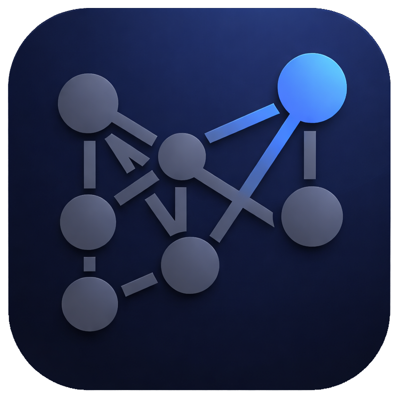

<div align="center">
  
  <h1>Noteriv</h1>
  <p><strong>Markdown notes, everywhere.</strong></p>
  <p>
    A powerful, open-source note-taking app built for writers, developers, and anyone who thinks in plain text.<br />
    Available on <strong>desktop</strong> (Windows, macOS, Linux) and <strong>mobile</strong> (Android, iOS).
  </p>
  <p>
    <strong>Note:</strong> The mobile app is a work in progress. All features ship to desktop first.
  </p>

  <p>
    <a href="https://www.noteriv.com"><strong>Website</strong></a> &middot;
    <a href="#-features"><strong>Features</strong></a> &middot;
    <a href="#-getting-started"><strong>Getting Started</strong></a> &middot;
    <a href="#-desktop-app"><strong>Desktop</strong></a> &middot;
    <a href="#-mobile-app"><strong>Mobile</strong></a> &middot;
    <a href="#-community"><strong>Community</strong></a> &middot;
    <a href="#-project-structure"><strong>Structure</strong></a> &middot;
    <a href="#-contributing"><strong>Contributing</strong></a>
  </p>

  <br />
</div>

---

## Why Noteriv?

Most note apps lock you into their cloud, their format, or their platform. Noteriv is different:

- **Your notes are plain markdown files.** No proprietary format. Open them in any editor, anywhere.
- **Your data stays yours.** Notes live on your device. Sync with GitHub if you want, or don't.
- **Same app on every platform.** Desktop and mobile with full feature parity. Edit on your laptop, review on your phone.
- **Extensible.** Plugins, themes, and CSS snippets let you make it your own.

---

## ✨ Features

### Editor

<table>
  <tr>
    <td width="50%">
      <h4>Writing</h4>
      <ul>
        <li><strong>Live markdown preview</strong> &mdash; See rendered output as you type</li>
        <li><strong>Source mode</strong> &mdash; Raw markdown with syntax highlighting</li>
        <li><strong>Read-only mode</strong> &mdash; Clean rendered view for reading</li>
        <li><strong>Formatting toolbar</strong> &mdash; Bold, italic, headings, links, lists, code, tables, horizontal rules</li>
        <li><strong>Auto-save</strong> &mdash; Configurable intervals (10s, 30s, 1m, 5m) or manual</li>
        <li><strong>Spell check</strong> &mdash; Toggle on/off</li>
        <li><strong>Vim mode</strong> &mdash; Optional vim keybindings (desktop)</li>
        <li><strong>Focus mode</strong> &mdash; Dims all lines except the active one for distraction-free writing. <code>Ctrl+Shift+D</code></li>
        <li><strong>Split editor</strong> &mdash; Open two notes side by side. Right-click tab → "Open in Split" or <code>Ctrl+\</code></li>
        <li><strong>Per-file view mode</strong> &mdash; Right-click in editor to set a default mode (Live/Source/View) per file, persisted across restarts</li>
        <li><strong>Multi-select sidebar</strong> &mdash; <code>Ctrl+Click</code> to toggle, <code>Shift+Click</code> for range. Merge, delete, or move in bulk</li>
      </ul>
    </td>
    <td width="50%">
      <h4>Markdown Support</h4>
      <ul>
        <li>Headings (H1&ndash;H6)</li>
        <li>Bold, italic, strikethrough, highlight</li>
        <li>Ordered &amp; unordered lists</li>
        <li>Task lists with checkboxes</li>
        <li>Tables with alignment + interactive checkboxes in cells</li>
        <li>Fenced code blocks with syntax highlighting</li>
        <li>Block &amp; inline math (LaTeX via KaTeX)</li>
        <li><strong>Mermaid diagrams</strong> &mdash; Flowcharts, sequence diagrams, Gantt charts, pie charts, and more rendered inline from <code>```mermaid</code> code blocks</li>
        <li>Callouts / admonitions (16+ types)</li>
        <li>Footnotes &amp; definition lists</li>
        <li>Superscript, subscript</li>
        <li>HTML blocks</li>
      </ul>
    </td>
  </tr>
</table>

### Knowledge Management

<table>
  <tr>
    <td width="50%">
      <h4>Linking &amp; Discovery</h4>
      <ul>
        <li><strong>Wiki-links</strong> &mdash; Link notes with <code>[[note name]]</code>, supports aliases <code>[[note|display]]</code> and headings <code>[[note#heading]]</code></li>
        <li><strong>Backlinks panel</strong> &mdash; See every note that links to the current file</li>
        <li><strong>Tags</strong> &mdash; Hierarchical tags with <code>#tag</code> and <code>#parent/child</code> syntax</li>
        <li><strong>Graph view</strong> &mdash; Interactive force-directed knowledge graph (desktop)</li>
        <li><strong>Hover preview</strong> &mdash; Preview linked notes on hover (desktop)</li>
      </ul>
    </td>
    <td width="50%">
      <h4>Organization</h4>
      <ul>
        <li><strong>Vaults</strong> &mdash; Multiple vaults for different projects or areas of life</li>
        <li><strong>Folders</strong> &mdash; Nested folder structure with drag-and-drop reordering</li>
        <li><strong>Bookmarks</strong> &mdash; Pin frequently accessed notes</li>
        <li><strong>Outline panel</strong> &mdash; Table of contents from headings</li>
        <li><strong>Quick open</strong> &mdash; Fuzzy file search across your vault</li>
        <li><strong>Vault search</strong> &mdash; Full-text search across all notes</li>
        <li><strong>Daily notes</strong> &mdash; Quick-access to today's note</li>
        <li><strong>Random note</strong> &mdash; Rediscover forgotten ideas</li>
      </ul>
    </td>
  </tr>
</table>

### Advanced Features

<table>
  <tr>
    <td width="33%">
      <h4>Content Tools</h4>
      <ul>
        <li><strong>Templates</strong> &mdash; Create notes from templates with variables (<code>{{date}}</code>, <code>{{time}}</code>, <code>{{title}}</code>, and more)</li>
        <li><strong>Frontmatter editor</strong> &mdash; YAML metadata editing with property suggestions</li>
        <li><strong>Note composer</strong> &mdash; Merge multiple notes or split by heading level</li>
        <li><strong>Note merge from sidebar</strong> &mdash; <code>Ctrl+Click</code> multiple files → right-click → "Merge N Notes" to combine with <code>---</code> separators</li>
        <li><strong>File recovery</strong> &mdash; Automatic snapshots (up to 50 per file) with one-tap restore</li>
        <li><strong>Slide presentations</strong> &mdash; Present markdown as slides (split by <code>---</code>), with speaker notes</li>
        <li><strong>PDF export</strong> &mdash; Export notes to PDF (desktop)</li>
        <li><strong>Table of contents</strong> &mdash; Type <code>[TOC]</code> to auto-generate a clickable table of contents from headings. Supports <code>&lt;!-- toc --&gt;</code> blocks that auto-update on save</li>
        <li><strong>Dataview queries</strong> &mdash; Query your vault like a database with <code>TABLE</code>, <code>LIST</code>, and <code>TASK</code> queries inside <code>```dataview</code> code blocks. Filter by tags, folders, frontmatter fields, and more</li>
        <li><strong>Publish as HTML</strong> &mdash; Export notes as standalone HTML pages using your current theme. Live preview, HTML editor, and multi-note publishing &mdash; combine multiple notes into a single page before saving</li>
        <li><strong>Flashcard review</strong> &mdash; Spaced repetition system using SM-2 algorithm. Add <code>Q:</code>/<code>A:</code> pairs or <code>{{cloze}}</code> deletions to notes, then review with keyboard-driven grading (Again/Hard/OK/Good/Easy). Progress saved per vault</li>
      </ul>
    </td>
    <td width="33%">
      <h4>Media &amp; Attachments</h4>
      <ul>
        <li><strong>Attachment manager</strong> &mdash; Browse, filter, and manage all vault attachments</li>
        <li><strong>Image support</strong> &mdash; PNG, JPG, GIF, SVG, WebP, and more</li>
        <li><strong>Audio files</strong> &mdash; MP3, WAV, OGG, FLAC, AAC</li>
        <li><strong>Video files</strong> &mdash; MP4, MKV, AVI, MOV</li>
        <li><strong>Audio recorder</strong> &mdash; Record voice notes directly in the app (desktop)</li>
        <li><strong>Canvas / Whiteboard</strong> &mdash; Infinite canvas with text nodes, sticky notes (6 colors), image nodes, freehand drawing, file embeds, groups, and edge connections. Toolbar with select, text, sticky, image, draw tools + color picker</li>
        <li><strong>PDF annotation</strong> &mdash; Open PDFs inline with highlight (4 colors), underline, and note tools. Annotation sidebar, auto-save to sidecar JSON, and one-click export to linked markdown with blockquotes and page references</li>
        <li><strong>Drawing editor</strong> &mdash; Built-in drawing canvas with pencil, shapes, arrows, text, and eraser tools. Full color picker, stroke widths, pan &amp; zoom. Drawings saved as <code>.drawing</code> files and embeddable in notes with <code>![[file.drawing]]</code></li>
      </ul>
    </td>
    <td width="33%">
      <h4>Sync</h4>
      <ul>
        <li><strong>GitHub sync</strong> &mdash; Push and pull notes to/from any GitHub repository</li>
        <li><strong>Auto-sync every 5 seconds</strong> &mdash; Always-on background sync, pull first then push. No config needed</li>
        <li><strong>Pull on open</strong> &mdash; Automatically pull latest changes when opening a vault</li>
        <li><strong>Folder sync</strong> &mdash; Sync with Google Drive, Dropbox, OneDrive, iCloud (desktop)</li>
        <li><strong>WebDAV sync</strong> &mdash; Sync with Nextcloud, ownCloud, or any WebDAV server (desktop)</li>
        <li><strong>Vault file watcher</strong> &mdash; Monitors the vault directory for external changes (from the MCP server, git pulls, other editors). Sidebar refreshes automatically; open files with no unsaved changes reload instantly; open files with unsaved changes are saved first before reloading</li>
      </ul>
    </td>
  </tr>
</table>

### Views

<table>
  <tr>
    <td width="50%">
      <h4>Board View</h4>
      <p>Turn any note into a drag-and-drop task board. Create <code>.board.md</code> files or add <code>board: true</code> to frontmatter. Columns are H2 headings, cards are checkbox items.</p>
      <ul>
        <li>Drag cards between columns</li>
        <li>Inline card editing (double-click)</li>
        <li>Tags shown as colored pills</li>
        <li>Due date badges</li>
        <li>Auto-saves every 5 seconds</li>
        <li>Switch to Source mode to edit raw markdown</li>
      </ul>
    </td>
    <td width="50%">
      <h4>Calendar View</h4>
      <p>Visual month calendar that surfaces your daily notes and tasks with due dates.</p>
      <ul>
        <li>Blue dots on days with daily notes</li>
        <li>Green dots on days with due tasks</li>
        <li>Click a day to see its notes and tasks</li>
        <li>Double-click to open or create a daily note</li>
        <li>Month navigation and "Today" button</li>
        <li>Accessible from the ribbon or command palette</li>
      </ul>
    </td>
  </tr>
</table>

### AI Integration

<table>
  <tr>
    <td colspan="2">
      <h4>MCP Server</h4>
      <p>Connect any MCP-compatible AI assistant (Claude, Cursor, etc.) directly to your Noteriv vault with full read/write access.</p>
      <ul>
        <li><strong>22 tools</strong> &mdash; read, write, append, delete, rename notes; list/create/delete folders; full-text search; tags, backlinks, outgoing links; vault stats; daily notes</li>
        <li><strong>Auto-discovers vaults</strong> &mdash; reads the same config file as the desktop app, no manual path setup needed</li>
        <li><strong>Multi-vault support</strong> &mdash; switch between vaults or pass a path directly as a CLI argument</li>
        <li><strong>Live sync</strong> &mdash; the desktop app watches the vault for external changes and automatically refreshes the sidebar and any open files when the MCP server (or anything else) modifies them</li>
        <li><strong>Soft delete</strong> &mdash; deleted notes go to <code>.noteriv/trash/</code>, restorable from the app</li>
        <li><strong>MCP resources</strong> &mdash; vault notes are exposed as <code>note:///</code> resources for direct access</li>
      </ul>
      <strong>Setup (Claude Code):</strong>
      <pre><code>claude mcp add --scope user noteriv -- npx -y noteriv-mcp</code></pre>
      <p>Or install from npm: <code>npx noteriv-mcp</code>. Auto-detects your active vault from the Noteriv config.</p>
    </td>
  </tr>
</table>

### Collaboration &amp; Sharing

<table>
  <tr>
    <td width="50%">
      <h4>Live Collaboration</h4>
      <p>Real-time co-editing using Yjs CRDT over WebRTC &mdash; peer-to-peer, no server required.</p>
      <ul>
        <li>Start a session and share the room ID</li>
        <li>Others join from the command palette</li>
        <li>Changes sync instantly between all peers</li>
        <li>Custom display name and cursor color</li>
        <li>Optional dependency: <code>npm install yjs y-webrtc</code></li>
      </ul>
    </td>
    <td width="50%">
      <h4>Publish as HTML</h4>
      <p>Export notes as beautiful standalone web pages using your current theme.</p>
      <ul>
        <li>Live preview before saving</li>
        <li>Edit the raw HTML directly</li>
        <li>Combine multiple notes into one page</li>
        <li>Search and select notes from your vault</li>
        <li>Copy HTML to clipboard or save as <code>.html</code></li>
        <li>Opens in your default browser after saving</li>
      </ul>
    </td>
  </tr>
  <tr>
    <td colspan="2">
      <h4>Web Clipper</h4>
      <p>Browser extension to save articles and selections as markdown notes directly into your vault.</p>
      <ul>
        <li>Clip full pages or selected text</li>
        <li>Pure JS HTML-to-markdown conversion (headings, links, images, lists, code, tables)</li>
        <li>Set title, tags, and target folder from the popup</li>
        <li>Right-click context menu: "Clip to Noteriv" / "Clip Selection to Noteriv"</li>
        <li>Auto-generates frontmatter with title, source URL, date, and tags</li>
        <li>Sidebar refreshes instantly when a note is clipped</li>
        <li>Localhost API server on port 27123 &mdash; auto-starts with the app</li>
        <li>Install: load <code>extension/</code> as unpacked extension in Chrome/Brave/Edge or temporary add-on in Firefox</li>
      </ul>
    </td>
  </tr>
</table>

### Customization

<table>
  <tr>
    <td width="50%">
      <h4>Themes</h4>
      <p>10 built-in themes with full dark and light mode support:</p>
      <table>
        <tr>
          <td><strong>Dark</strong></td>
          <td>Catppuccin Mocha, Nord, Dracula, Solarized Dark, One Dark, Gruvbox Dark, Tokyo Night, GitHub Dark</td>
        </tr>
        <tr>
          <td><strong>Light</strong></td>
          <td>Catppuccin Latte, Solarized Light</td>
        </tr>
      </table>
      <br />
      <ul>
        <li>Community themes from <a href="https://github.com/thejacedev/NoterivThemes">NoterivThemes</a></li>
        <li>Custom theme creation and import/export (desktop)</li>
        <li>8 accent colors: Blue, Lavender, Mauve, Pink, Peach, Yellow, Green, Teal</li>
      </ul>
    </td>
    <td width="50%">
      <h4>Ecosystem</h4>
      <p><strong>Plugins</strong></p>
      <ul>
        <li>Install community plugins from <a href="https://github.com/thejacedev/NoterivPlugins">NoterivPlugins</a></li>
        <li>Plugin API with vault access, UI commands, events, and editor integration</li>
        <li>Enable/disable per vault</li>
      </ul>
      <p><strong>CSS Snippets</strong></p>
      <ul>
        <li>Create custom CSS to style the editor and preview</li>
        <li>Install community snippets from <a href="https://github.com/thejacedev/NoterivSnippets">NoterivSnippets</a></li>
        <li>Toggle snippets on/off individually</li>
      </ul>
    </td>
  </tr>
</table>

### Editor Settings

| Setting | Options |
|---|---|
| Auto-save interval | Off, 10s, 30s, 1 min, 5 min (sync auto every 5s) |
| Font size | 12px &ndash; 24px |
| Line height | 1.2 &ndash; 2.0 |
| Tab size | 2, 4, 8 |
| Editor font | JetBrains Mono, Fira Code, Cascadia Code, Source Code Pro, SF Mono, System Mono |
| Theme | 10 built-in + community + custom |
| Accent color | 8 options |
| Spell check | On / Off |

---

## 🚀 Getting Started

### Prerequisites

- [Node.js](https://nodejs.org/) 18+
- [npm](https://www.npmjs.com/)
- [Git](https://git-scm.com/) (for GitHub sync features)

### Clone the repo

```bash
git clone https://github.com/thejacedev/Noteriv.git
cd Noteriv
```

---

## 🖥 Desktop App

> **Electron + Next.js** &mdash; Windows, macOS, Linux

The desktop app provides the full Noteriv experience with a CodeMirror-based editor, native file system access, and Git integration via the system's git binary.

### Development

```bash
cd desktop
npm install
npm run dev
```

This starts both the Next.js dev server (port 3456) and the Electron window simultaneously.

### Build

```bash
cd desktop
npm run build
```

Builds distributable packages to `desktop/dist/`:

| Platform | Format |
|---|---|
| Linux | AppImage, .deb, .rpm |
| macOS | .dmg |
| Windows | .exe (NSIS installer) |

### Desktop Architecture

```
desktop/
├── main/                 Electron main process
│   ├── main.js           App entry, IPC handlers, window management
│   ├── preload.js        Context bridge (92 methods)
│   ├── store.js          Persistent config (vaults, settings)
│   ├── auth.js           GitHub token encryption (OS keychain)
│   ├── updater.js        Auto-update via electron-updater
│   └── sync/
│       ├── git.js        Git operations via child_process
│       ├── folder.js     Folder sync (bidirectional, mtime-based)
│       ├── webdav.js     WebDAV sync
│       ├── helpers.js    Shared sync utilities
│       └── index.js      Sync orchestrator
├── src/
│   ├── app/
│   │   ├── page.tsx      Main app (90+ state variables)
│   │   ├── layout.tsx    Next.js root layout
│   │   └── globals.css   Global styles + CSS variables
│   ├── components/       41 React components
│   │   ├── Editor.tsx           CodeMirror markdown editor
│   │   ├── Sidebar.tsx          File tree with drag-drop
│   │   ├── TitleBar.tsx         Tabs + window controls
│   │   ├── SettingsModal.tsx    6-section settings
│   │   ├── SetupWizard.tsx      First-run wizard
│   │   ├── GraphView.tsx        Force-directed knowledge graph
│   │   ├── Canvas.tsx           Visual whiteboard
│   │   ├── SlidePresentation.tsx  Markdown presentations
│   │   ├── CommandPalette.tsx   Searchable action palette
│   │   ├── ThemePicker.tsx      Theme browser + installer
│   │   ├── PluginManager.tsx    Plugin browser + installer
│   │   ├── CSSSnippets.tsx      Snippet editor + community
│   │   ├── DrawingEditor.tsx    Canvas drawing editor (pencil, shapes, arrows, text, eraser)
│   │   ├── CalendarView.tsx     Month calendar with daily notes + tasks
│   │   ├── BoardView.tsx        Drag-and-drop task board
│   │   ├── DataviewBlock.tsx    Vault query result renderer
│   │   ├── PublishPreview.tsx   HTML export preview + multi-note publish
│   │   ├── FlashcardReview.tsx  Spaced repetition flashcard review
│   │   ├── CollabPanel.tsx      Live collaboration session manager
│   │   ├── PDFViewer.tsx        PDF viewer with annotation tools
│   │   └── markdown/            Live rendering engine
│   │       ├── plugin.ts        CodeMirror ViewPlugin
│   │       ├── registry.ts      Renderer registration
│   │       ├── renderers/       15 block + inline renderers
│   │       ├── callouts.ts      Obsidian-style admonitions
│   │       ├── embeds.ts        Note embedding (![[file]])
│   │       ├── math.ts          KaTeX rendering
│   │       ├── mermaid.ts       Diagram rendering
│   │       ├── wikilinks.ts     Interactive wiki-links
│   │       └── slash-commands.ts  / command menu
│   ├── lib/              33 utility modules
│   │   ├── settings.ts          App settings + defaults
│   │   ├── theme-utils.ts       10 built-in themes + community
│   │   ├── plugin-api.ts        Plugin sandbox + API
│   │   ├── css-snippets.ts      CSS snippet system
│   │   ├── hotkeys.ts           70+ rebindable shortcuts
│   │   ├── editor-commands.ts   Formatting commands
│   │   ├── wiki-link-utils.ts   Link parsing + resolution
│   │   ├── tag-utils.ts         Tag extraction + aggregation
│   │   ├── frontmatter-utils.ts YAML frontmatter
│   │   ├── template-utils.ts    Template variables
│   │   ├── file-recovery.ts     Snapshot system
│   │   ├── note-composer-utils.ts  Merge + split
│   │   ├── attachment-utils.ts  Media management
│   │   ├── audio-utils.ts       Recording utilities
│   │   ├── canvas-utils.ts      Canvas data model
│   │   ├── slide-utils.ts       Presentation parser
│   │   ├── pdf-export.ts        PDF export
│   │   ├── sync-providers.ts    Folder + WebDAV config
│   │   ├── vim-mode.ts          Vim keybindings
│   │   ├── drawing-utils.ts     Drawing file create/parse/serialize/export
│   │   ├── calendar-utils.ts    Calendar grid, daily note mapping, task extraction
│   │   ├── board-utils.ts       Board parse/serialize, card/column CRUD
│   │   ├── dataview.ts          Vault query engine (TABLE, LIST, TASK)
│   │   ├── toc-utils.ts         Table of contents generation + auto-update
│   │   ├── publish.ts           HTML export with theme colors
│   │   ├── flashcard-utils.ts   SM-2 spaced repetition + card extraction
│   │   ├── collab.ts            Yjs CRDT + WebRTC collaboration
│   │   ├── focus-mode.ts        Focus/typewriter mode extension
│   │   └── pdf-annotation.ts   PDF annotation types + sidecar I/O + markdown export
│   └── types/
│       └── electron.d.ts  IPC type definitions (50+ methods)
└── public/               App icons (macOS, Windows, Linux)
```

---

## 📱 Mobile App

> **Expo + React Native** &mdash; Android, iOS
>
> **Work in progress.** All features come to desktop first, then mobile.

The mobile app aims for feature parity with the desktop, adapted for touch interfaces. Notes are stored in the app's document directory and synced via the GitHub REST API.

### Development

```bash
cd phone
npm install
npx expo start
```

| Command | Description |
|---|---|
| `npx expo start` | Start Expo dev server |
| `npx expo start --android` | Open on Android device/emulator |
| `npx expo start --ios` | Open on iOS simulator |

### Mobile Architecture

```
phone/
├── app/                  Screens (Expo Router, file-based routing)
│   ├── _layout.tsx       Root layout + theme provider
│   ├── index.tsx          Home (notes list, daily note, random note)
│   ├── editor.tsx         Markdown editor + preview
│   ├── settings.tsx       Settings (themes, GitHub, ecosystem)
│   ├── setup.tsx          First-run wizard with GitHub auth
│   ├── templates.tsx      Template picker
│   ├── recovery.tsx       File recovery / snapshots
│   ├── composer.tsx       Note merge + split
│   ├── attachments.tsx    Attachment manager
│   ├── backlinks.tsx      Backlinks viewer
│   ├── frontmatter.tsx    YAML frontmatter editor
│   ├── slides.tsx         Slide presentation viewer
│   ├── snippets.tsx       CSS snippets (installed + community)
│   ├── plugins.tsx        Plugin manager (installed + community)
│   ├── calendar.tsx       Monthly calendar with daily note dots + due tasks
│   ├── flashcards.tsx     SM-2 spaced repetition flashcard review
│   ├── graph.tsx          Force-directed wiki-link graph (WebView canvas)
│   ├── trash.tsx          Trash / soft delete with restore
│   └── publish.tsx        Publish note as HTML + share sheet
├── components/
│   ├── MarkdownEditor.tsx   TextInput editor + formatting toolbar
│   ├── MarkdownPreview.tsx  Custom markdown renderer
│   ├── NotesList.tsx        File/folder browser
│   ├── SearchModal.tsx      Quick open + vault search
│   ├── CreateModal.tsx      Create file/folder
│   ├── VaultSwitcher.tsx    Switch/create vaults
│   ├── OutlinePanel.tsx     Document outline
│   ├── BookmarksPanel.tsx   Bookmarked files
│   ├── TagsPanel.tsx        Hierarchical tag browser
│   └── BoardView.tsx        Board view with columns + cards
├── context/
│   ├── AppContext.tsx       Global state (vault, settings, files, auto-sync)
│   └── ThemeContext.tsx     Dynamic theme provider
├── lib/
│   ├── file-system.ts       expo-file-system class API wrapper
│   ├── vault.ts             Vault CRUD + workspace
│   ├── settings.ts          Settings with defaults
│   ├── storage.ts           AsyncStorage wrappers
│   ├── github-sync.ts       GitHub REST API sync (push/pull)
│   ├── templates.ts         Template listing + variables
│   ├── frontmatter.ts       YAML parse/serialize
│   ├── file-recovery.ts     Snapshot system
│   ├── note-composer.ts     Merge + split
│   ├── wiki-links.ts        Link parsing + backlinks
│   ├── attachments.ts       Attachment management
│   ├── slide-utils.ts       Slide parser
│   ├── daily-note.ts        Daily note helper
│   ├── random-note.ts       Random note picker
│   ├── css-snippets.ts      CSS snippet system
│   ├── plugins.ts           Plugin management
│   ├── community.ts         Community theme support
│   ├── calendar-utils.ts    Month grid, task extraction
│   ├── flashcard-utils.ts   SM-2 algorithm, card extraction
│   ├── markdown-lint.ts     Linting rules (wiki-links, headings, code blocks)
│   ├── note-history.ts      Line-based diff (LCS algorithm)
│   ├── publish.ts           Markdown-to-HTML converter
│   ├── board-utils.ts       Board parse/serialize, card CRUD
│   └── dataview.ts          Vault query engine
├── constants/
│   └── theme.ts             10 built-in themes + accent colors
└── types/
    └── index.ts             TypeScript interfaces
```

### Mobile vs Desktop

Both apps share the same feature set with platform-appropriate adaptations:

| Feature | Desktop | Mobile |
|---|---|---|
| Editor | CodeMirror 6 | TextInput + toolbar |
| Git sync | Native git binary | GitHub REST API + fresh clone |
| File storage | Any filesystem path | App document directory |
| Themes | 10 built-in + custom creator | 10 built-in + community install |
| Plugins | Sandbox execution | Install + enable/disable |
| Navigation | Sidebar + tabs + split editor | Stack navigation + swipe between notes |
| Graph view | Force-directed canvas | Force-directed WebView canvas |
| Board view | Drag-drop columns | Horizontal scroll columns with move actions |
| Calendar | Monthly grid | Monthly grid with daily note dots |
| Flashcards | SM-2 spaced repetition | SM-2 spaced repetition |
| Canvas | SVG whiteboard | &mdash; |
| Vim mode | CodeMirror vim extension | &mdash; |
| Audio recorder | MediaRecorder API | &mdash; |
| Drawing editor | Canvas with tools | &mdash; |
| PDF viewer | Inline annotations | &mdash; |
| Keyboard shortcuts | 70+ rebindable | System defaults |

---

## 🌐 Community

Noteriv has a growing ecosystem of community-created extensions. Browse and install them directly from the app.

<table>
  <tr>
    <td align="center" width="33%">
      <h3>Plugins</h3>
      <a href="https://github.com/thejacedev/NoterivPlugins">
        <strong>thejacedev/NoterivPlugins</strong>
      </a>
      <br /><br />
      <p>Extend Noteriv with custom commands, sidebar panels, status bar items, and editor integrations. Plugins have access to the vault filesystem, editor state, and event system.</p>
      <br />
      <sub>
        <strong>Plugin API:</strong> vault read/write, UI commands, event listeners (file-open, file-save, editor-change, etc.), editor manipulation (insert, replace, cursor)
      </sub>
    </td>
    <td align="center" width="33%">
      <h3>Themes</h3>
      <a href="https://github.com/thejacedev/NoterivThemes">
        <strong>thejacedev/NoterivThemes</strong>
      </a>
      <br /><br />
      <p>Community color themes beyond the 10 built-in options. Themes define 16 color properties covering backgrounds, text, accent, and syntax colors.</p>
      <br />
      <sub>
        <strong>Theme format:</strong> JSON with id, name, type (dark/light), and colors object. Import/export supported on desktop.
      </sub>
    </td>
    <td align="center" width="33%">
      <h3>CSS Snippets</h3>
      <a href="https://github.com/thejacedev/NoterivSnippets">
        <strong>thejacedev/NoterivSnippets</strong>
      </a>
      <br /><br />
      <p>Fine-tune the editor and preview with custom CSS. Snippets are stored per-vault and can be toggled individually. Community snippets are organized by category.</p>
      <br />
      <sub>
        <strong>Snippet storage:</strong> <code>.noteriv/snippets/</code> directory with per-snippet <code>.css</code> files and a config JSON for enable/disable state.
      </sub>
    </td>
  </tr>
</table>

### Creating Plugins

Plugins live in `.noteriv/plugins/{plugin-id}/` inside your vault. Each plugin needs:

```
my-plugin/
├── manifest.json    Plugin metadata
└── main.js          Entry point
```

**manifest.json:**
```json
{
  "id": "my-plugin",
  "name": "My Plugin",
  "version": "1.0.0",
  "description": "What this plugin does",
  "author": "Your Name",
  "main": "main.js"
}
```

**main.js:**
```javascript
module.exports = {
  onLoad(api) {
    api.ui.addCommand({
      id: "hello",
      name: "Say Hello",
      callback: () => api.ui.showNotice("Hello from my plugin!")
    });
  },
  onUnload() {
    // cleanup
  }
};
```

### Creating Themes

Themes are JSON files with 16 color properties:

```json
{
  "id": "my-theme",
  "name": "My Theme",
  "type": "dark",
  "colors": {
    "bgPrimary": "#1a1b26",
    "bgSecondary": "#16161e",
    "bgTertiary": "#24283b",
    "border": "#3b4261",
    "textPrimary": "#c0caf5",
    "textSecondary": "#a9b1d6",
    "textMuted": "#565f89",
    "accent": "#7aa2f7",
    "green": "#9ece6a",
    "red": "#f7768e",
    "yellow": "#e0af68",
    "blue": "#7aa2f7",
    "mauve": "#bb9af7",
    "peach": "#ff9e64",
    "teal": "#73daca",
    "pink": "#bb9af7"
  }
}
```

Save to `.noteriv/themes/my-theme.json` or submit a PR to [NoterivThemes](https://github.com/thejacedev/NoterivThemes).

---

## 📁 Project Structure

```
Noteriv/
├── desktop/              Electron + Next.js desktop application
│   ├── main/             Electron main process (IPC, file I/O, Git, sync, clipper server, vault watcher)
│   ├── src/components/   41 React components + markdown rendering engine
│   ├── src/lib/          33 utility modules
│   └── public/           Platform icons + pdf.js worker
├── mcp/                  MCP server for AI assistant integration (22 tools, auto-discovers vaults)
├── extension/            Web Clipper browser extension (Manifest V3)
├── phone/                Expo + React Native mobile application
│   ├── app/              19 screens (Expo Router)
│   ├── components/       11 UI components
│   ├── lib/              24 utility modules
│   └── context/          App state + theme contexts
├── .github/workflows/    CI/CD (build + release)
├── LICENSE               MIT License
└── README.md
```

---

## 🔧 Development

### Commands

| Command | Description |
|---|---|
| `cd desktop && npm run dev` | Desktop dev mode (Next.js + Electron) |
| `cd desktop && npm run build` | Build desktop distributables |
| `cd desktop && npm run build:next` | Build Next.js only |
| `cd mcp && npm install` | Install MCP server dependencies |
| `node mcp/index.js` | Run MCP server (manual vault path optional) |
| `cd phone && npx expo start` | Mobile dev server |
| `cd phone && npx expo start --android` | Run on Android |
| `cd phone && npx expo start --ios` | Run on iOS |
| `cd phone && npx expo export` | Export mobile app bundle |

### Tech Stack

| Layer | Desktop | Mobile |
|---|---|---|
| Framework | Next.js 16 | Expo 54 |
| UI | React 19 | React Native 0.81 |
| Editor | CodeMirror 6 | TextInput + custom renderer |
| Runtime | Electron 40 | Expo Router 6 |
| File I/O | Node.js fs | expo-file-system |
| Sync | child_process git | GitHub REST API |
| Storage | JSON files | AsyncStorage |
| Styling | Tailwind CSS 4 | StyleSheet + dynamic themes |
| Math | KaTeX | &mdash; |
| Diagrams | Mermaid | &mdash; |

---

## 🤝 Contributing

Contributions are welcome! Here's how you can help:

1. **Report bugs** &mdash; Open an issue with steps to reproduce
2. **Suggest features** &mdash; Open an issue describing what you'd like to see
3. **Submit code** &mdash; Fork, create a branch, make your changes, and open a PR
4. **Create plugins** &mdash; Build and share plugins via [NoterivPlugins](https://github.com/thejacedev/NoterivPlugins)
5. **Create themes** &mdash; Design and share themes via [NoterivThemes](https://github.com/thejacedev/NoterivThemes)
6. **Create snippets** &mdash; Write and share CSS snippets via [NoterivSnippets](https://github.com/thejacedev/NoterivSnippets)

---

## 📄 License

[MIT](LICENSE) &copy; Jace Sleeman

<div align="center">
  <br />
  <sub>Built with care by <a href="https://github.com/thejacedev">@thejacedev</a></sub>
</div>
