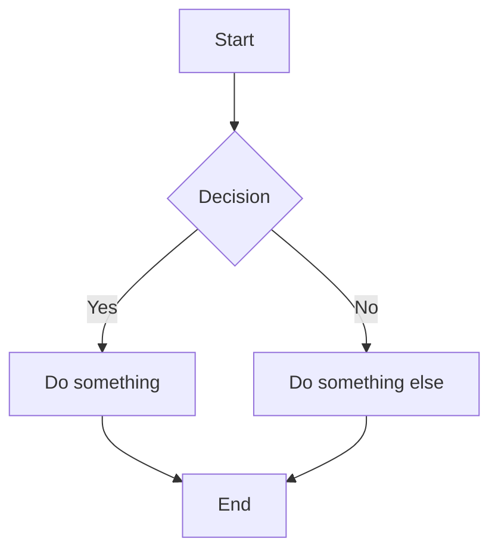

# Markdown Syntax Reference

Noteriv supports standard markdown plus several extensions. This page documents every syntax element with examples.

---

## Headings

```markdown
# Heading 1
## Heading 2
### Heading 3
#### Heading 4
##### Heading 5
###### Heading 6
```

A space is required between the `#` characters and the heading text. You can have only one H1 per note (the markdown linter will warn about multiple H1 headings).

---

## Inline Formatting

### Bold

```markdown
**bold text**
```

Renders as: **bold text**

### Italic

```markdown
*italic text*
```

Renders as: *italic text*

### Bold and Italic

```markdown
***bold and italic***
```

### Strikethrough

```markdown
~~strikethrough text~~
```

Renders as: ~~strikethrough text~~

### Highlight

```markdown
==highlighted text==
```

Renders with a colored background (yellow by default). Highlighting is a Noteriv extension not found in standard markdown.

### Inline Code

```markdown
Use the `console.log()` function.
```

Renders with a monospace font and a subtle background.

### Superscript

```markdown
E = mc^2^
```

Text between single carets is rendered as superscript.

### Subscript

```markdown
H~2~O
```

Text between single tildes is rendered as subscript. Note: this is different from strikethrough, which uses double tildes.

---

## Math

Noteriv renders math using KaTeX. Both inline and block math are supported.

### Inline Math

```markdown
The equation $E = mc^2$ describes mass-energy equivalence.
```

Wrap LaTeX in single dollar signs for inline math that flows with the surrounding text.

### Block Math

```markdown
$$
\int_0^\infty e^{-x^2} dx = \frac{\sqrt{\pi}}{2}
$$
```

Wrap LaTeX in double dollar signs on their own lines for centered, display-mode math.

### Supported LaTeX Commands

KaTeX supports a wide range of LaTeX commands including fractions (`\frac`), integrals (`\int`), summations (`\sum`), matrices (`\begin{bmatrix}`), Greek letters (`\alpha`, `\beta`, `\gamma`), operators (`\sin`, `\cos`, `\log`), and many more. See the [KaTeX documentation](https://katex.org/docs/supported.html) for the full list.

---

## Links

### External Links

```markdown
[Noteriv Website](https://www.noteriv.com)
```

### Wiki-Links

```markdown
[[Another Note]]
```

Wiki-links create internal links between notes. The link target is the note name without the file extension. Noteriv resolves wiki-links by searching all folders in the vault for a matching filename.

### Wiki-Links with Aliases

```markdown
[[actual-note-name|Display Text]]
```

The display text is shown in the preview, but the link points to `actual-note-name.md`.

### Embeds

```markdown
![[embedded-note]]
```

Embeds inline the full content of another note at the embed location. In preview mode, the embedded note's content is rendered as if it were part of the current note.

---

## Images

### Standard Images

```markdown

```

### Images with Dimensions

```markdown

```

Specify width and height in pixels using the `|WxH` syntax after the alt text. You can also specify just width:

```markdown

```

### Local Images

```markdown

```

Reference images stored in your vault using relative paths.

---

## Lists

### Unordered Lists

```markdown
- Item one
- Item two
  - Nested item
  - Another nested item
- Item three
```

You can also use `*` or `+` as list markers.

### Ordered Lists

```markdown
1. First item
2. Second item
3. Third item
```

### Task Lists

```markdown
- [ ] Unchecked task
- [x] Completed task
- [ ] Another task
```

In view mode and preview, checkboxes are interactive. Clicking them toggles the `[ ]`/`[x]` state in the underlying markdown file automatically.

---

## Blockquotes

```markdown
> This is a blockquote.
> It can span multiple lines.
```

Blockquotes are rendered with a colored left border and slightly indented text.

---

## Callouts

Callouts are special blockquotes with a type identifier. Noteriv supports 14 callout types:

```markdown
> [!note] Title
> Callout content goes here.
```

See [Callouts](./callouts.md) for all 14 types with their icons and colors.

### Collapsible Callouts

```markdown
> [!tip]- Collapsed by default
> This content is hidden until expanded.

> [!tip]+ Expanded by default
> This content is visible but can be collapsed.
```

Use `-` after the type for initially collapsed, `+` for initially expanded.

---

## Code Blocks

### Fenced Code Blocks

````markdown
```javascript
function greet(name) {
  return `Hello, ${name}!`;
}
```
````

### Supported Languages

Noteriv provides syntax highlighting for the following languages:

| Language | Identifier |
|---|---|
| JavaScript | `javascript` or `js` |
| TypeScript | `typescript` or `ts` |
| Python | `python` or `py` |
| Rust | `rust` or `rs` |
| Go | `go` |
| Java | `java` |
| C | `c` |
| C++ | `cpp` or `c++` |
| HTML | `html` |
| CSS | `css` |
| JSON | `json` |
| YAML | `yaml` or `yml` |

Code blocks without a language identifier are rendered as plain monospace text.

---

## Tables

```markdown
| Name | Role | Status |
|---|---|---|
| Alice | Developer | Active |
| Bob | Designer | On leave |
| Carol | PM | Active |
```

Tables support alignment with colons in the separator row:

```markdown
| Left | Center | Right |
|:---|:---:|---:|
| text | text | text |
```

### Interactive Checkboxes in Tables

Tables can include checkboxes that are interactive in view/preview mode:

```markdown
| Task | Done |
|---|---|
| Write docs | [ ] |
| Review PR | [x] |
```

Clicking a checkbox in the rendered table toggles its state and updates the source file.

---

## Horizontal Rule

```markdown
---
```

Renders as a horizontal divider line. Three or more hyphens, asterisks, or underscores on their own line.

---

## Table of Contents

```markdown
[TOC]
```

Place `[TOC]` on its own line to generate an automatic table of contents from the note's headings. The TOC is rendered as a nested list of links that jump to each heading.

---

## Mermaid Diagrams

````markdown

````

Noteriv renders Mermaid diagrams inline in the preview. Supported diagram types include flowcharts, sequence diagrams, Gantt charts, class diagrams, state diagrams, entity-relationship diagrams, and pie charts. See the [Mermaid documentation](https://mermaid.js.org/) for the full syntax reference.

---

## Dataview

````markdown
```dataview
TABLE status, due FROM #project WHERE status != "done" SORT BY due
```
````

Dataview queries let you treat your notes as a database. The query engine supports three query types:

### TABLE

```
TABLE field1, field2 FROM source WHERE condition SORT BY field LIMIT n
```

Renders results as a table with the specified fields as columns.

### LIST

```
LIST FROM source WHERE condition SORT BY field
```

Renders a simple list of matching note names.

### TASK

```
TASK FROM source WHERE condition
```

Collects all task list items (`- [ ]` and `- [x]`) from matching notes.

### Source Filters

- `FROM #tag` -- Notes containing a specific tag
- `FROM "folder"` -- Notes in a specific folder
- Omit `FROM` to query all notes

### WHERE Conditions

- `field = "value"` -- Exact match
- `field != "value"` -- Not equal
- `field > "value"` -- Greater than (string comparison)
- `contains(field, "value")` -- Field contains substring
- Combine with `AND` and `OR`
- Negate with `!`

### Queryable Fields

- `file.name` -- Note filename (without extension)
- `file.path` -- Relative path from vault root
- `file.folder` -- Parent folder path
- `file.tags` -- List of tags in the note
- Any frontmatter field (e.g., `status`, `due`, `priority`)

---

## Flashcards

Noteriv extracts flashcards from your notes for spaced repetition review.

### Q:/A: Format

```markdown
Q: What is the capital of Japan?
A: Tokyo

Q: What year was the World Wide Web invented?
A: 1989
```

Each Q: line followed by an A: line on the next line creates one flashcard.

### Cloze Deletions

```markdown
The {{mitochondria}} is the powerhouse of the cell.

{{Paris}} is the capital of France.
```

Text wrapped in double curly braces becomes a cloze deletion. During review, the cloze text is hidden and you must recall it.

---

## Definition Lists

```markdown
Term
: Definition of the term.

Another Term
: First definition.
: Second definition.
```

A term on one line followed by `: Definition` on the next line creates a definition list. You can have multiple definitions per term.

---

## Footnotes

```markdown
This claim needs a source.[^1]

Another statement with a reference.[^note]

[^1]: Source: Smith et al., 2024.
[^note]: See the appendix for details.
```

Footnote references are rendered as superscript numbers that link to the footnote definition at the bottom of the note. Footnote IDs can be numbers or text.

---

## Escaping

To display a literal character that would otherwise be interpreted as markdown formatting, prefix it with a backslash:

```markdown
\*not italic\*
\#not a heading
\[\[not a wiki-link\]\]
```

---

## Frontmatter

```markdown
---
title: My Note
tags: [project, active]
status: in-progress
due: 2026-04-01
---
```

YAML frontmatter at the top of a note defines metadata. See [Frontmatter](./frontmatter.md) for all recognized fields.
